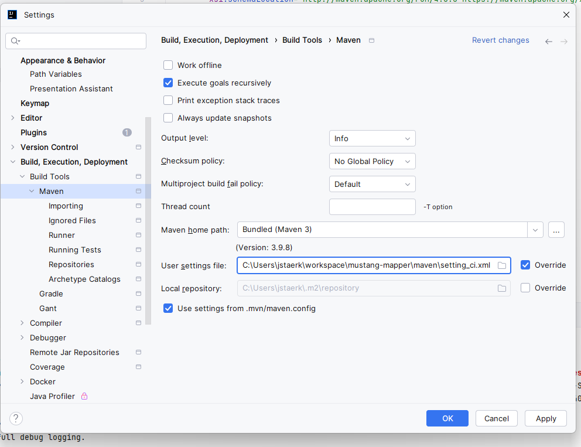

Set a maven user settings file via
Settings|Build,Execution, Deployment|Build Tools|Maven
user settings file, check override, select maven_settings_ci.xml



Accordingly, the commandline is
```
 mvn -s maven\setting_ci.xml clean package 

```

Deploy /converterdata/ into the same directory like the war file.